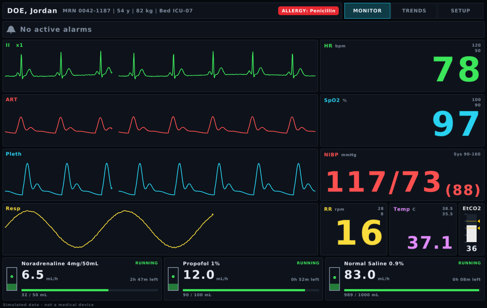
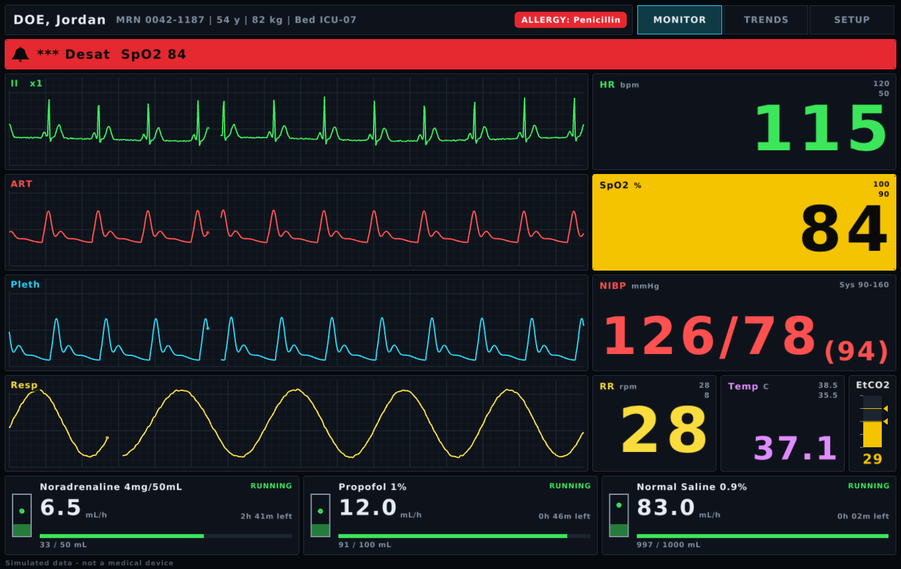
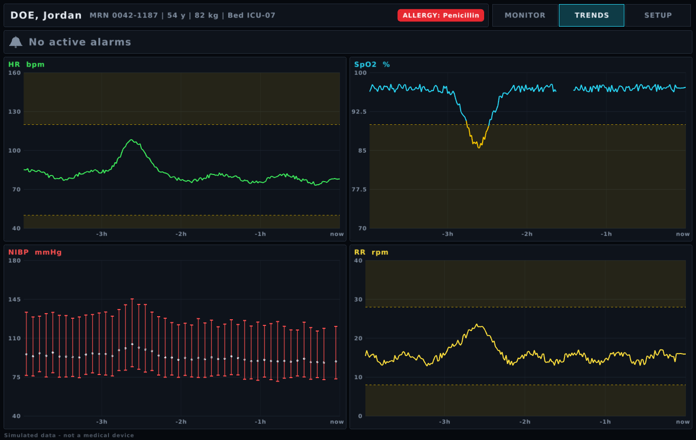
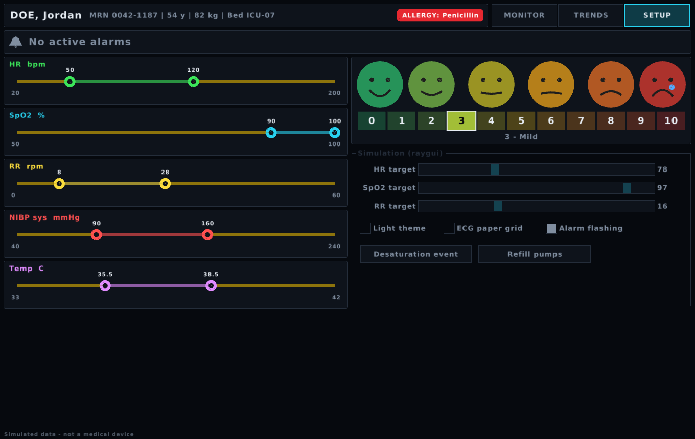
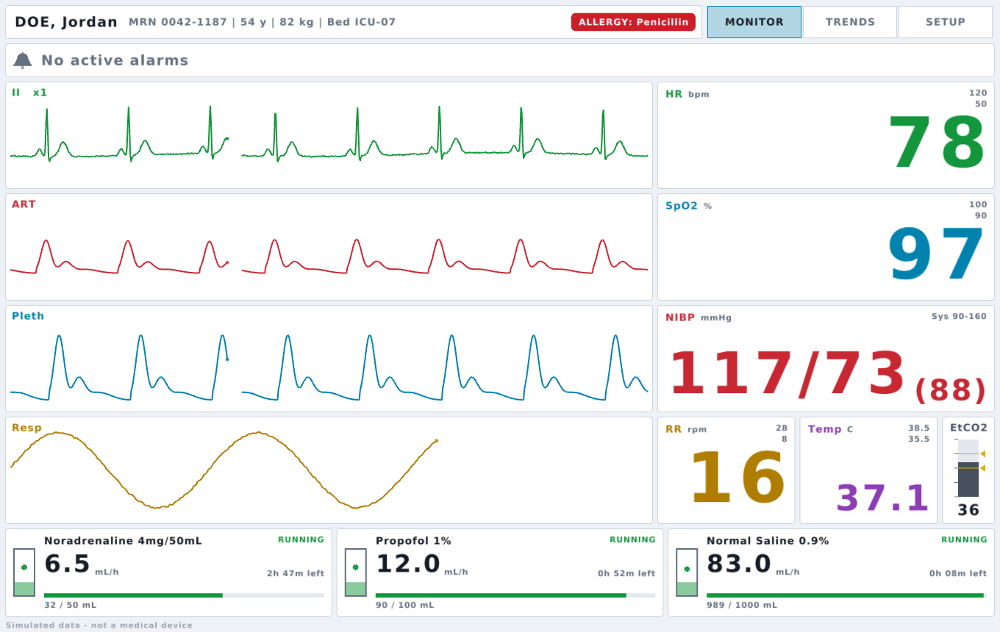
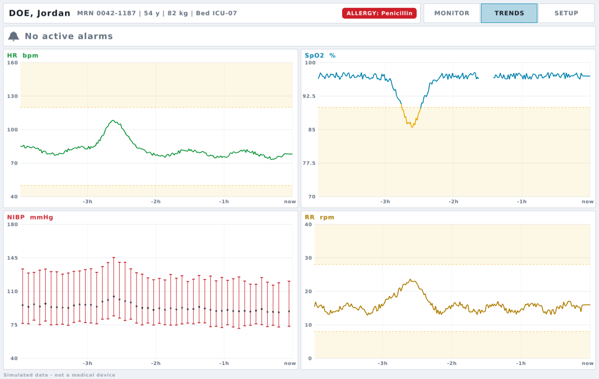

# raymed

Medical-themed immediate-mode widgets for raylib, built the same way as raygui: a single header, one call per frame per control, and an int return value.

```c
#define RAYMED_IMPLEMENTATION
#include "raymed.h"
```

It works on its own or alongside raygui. If `raygui.h` is included first, raymed respects `GuiLock()`/`GuiDisable()` and uses `GuiGetFont()`.

## Screenshots

**Monitor.** Sweep waveforms, vital-sign tiles, NIBP, EtCO2 gauge and infusion pumps.


**Alarm state.** A high-priority desaturation alarm, an out-of-limits SpO2 tile, and the ECG paper grid switched on.


**Trends.** Alarm-limit bands, a probe-off gap in the SpO2 data, and NIBP bars.


**Setup.** Dual-thumb alarm limit editors and the pain scale, next to plain raygui controls in the same theme.


**Light theme.**

| Monitor | Trends |
|---|---|
|  |  |

## Controls

| Call | Returns |
|---|---|
| `GuiWaveform(bounds, label, &waveBuffer, color)` — monitor-style sweep with erase bar | 1 if clicked |
| `GuiVitalSign(bounds, label, units, value, decimals, lo, hi, color)` — big numeric tile, flashes out of limits | 1 if clicked |
| `GuiBloodPressure(bounds, label, sys, dia, sysLo, sysHi, color)` — `120/80 (93)` with MAP | 1 if clicked |
| `GuiTrendChart(bounds, label, values, count, min, max, lo, hi, color)` — alarm bands, time axis, NaN gaps | hovered index / -1 |
| `GuiBloodPressureTrend(bounds, label, sys, dia, count, min, max, color)` — NIBP whiskers | hovered index / -1 |
| `GuiAlarmBanner(bounds, text, priority)` — high/medium/low with IEC-style flash rates | 1 if clicked (ack) |
| `GuiBarGauge(bounds, label, value, min, max, lo, hi, color)` — vertical if h > w | 1 if clicked |
| `GuiAlarmLimits(bounds, label, &lo, &hi, min, max, step, current, color)` — dual-thumb slider | 1 if changed |
| `GuiPainScale(bounds, &value)` — 0–10 NRS with faces | 1 if changed |
| `GuiInfusion(bounds, drug, rate, infused, volume, running)` — pump status with animated drip | 1 if clicked |
| `GuiPatientBanner(bounds, name, details, allergies)` — shows NKDA when there are no allergies | 1 if clicked |

Waveforms read from a `GuiWaveBuffer` that uses storage you provide (raymed never allocates):

```c
static float ecgData[750];
GuiWaveBuffer ecg;
GuiWaveBufferInit(&ecg, ecgData, 750, -0.6f, 1.4f);   // 6 s at 125 Hz
GuiWaveBufferPush(&ecg, sample);                      // at your sample rate
GuiWaveform(rec, "II", &ecg, GuiMedColor(MED_COLOR_ECG));
```

A limit of `NAN` means "off", and a `NAN` value shows `-?-`.

## Style

`GuiMedSetStyle(prop, value)` and `GuiMedGetStyle(prop)` work like raygui's, with colors stored via `ColorToInt`. There are two built-in themes, `GuiMedLoadStyleDark()` (bedside monitor) and `GuiMedLoadStyleLight()`. Parameter colors follow monitor conventions (`MED_COLOR_ECG`, `_SPO2`, `_BP`, `_RESP`, `_TEMP`, `_CO2`) and change with the theme. Other useful properties are `MED_WAVE_GRID` (ECG paper), `MED_FLASH_ENABLED`, and `MED_TREND_SAMPLE_SECONDS` (sets the trend chart's time axis). For crisp numbers, load a large TTF and pass it to `GuiMedSetFont()`.

## Demo

`make && ./demo`. To regenerate the screenshots, run `./demo --shot <page> <file.png> [flags]`, where the flags are `d` (desaturation event), `l` (light theme) and `g` (ECG grid). It simulates a patient and has three pages: Monitor, Trends and Setup (the Setup page mixes in plain raygui controls).
Keys: `1/2/3` switch pages, `D` triggers a desaturation event, `L` toggles light theme. Click the ECG trace to toggle the grid, a pump to pause or run it, or a vital tile to jump to its limits. Click the alarm banner to acknowledge.

Not a medical device. It is intended for visualisation, simulation and training only.
